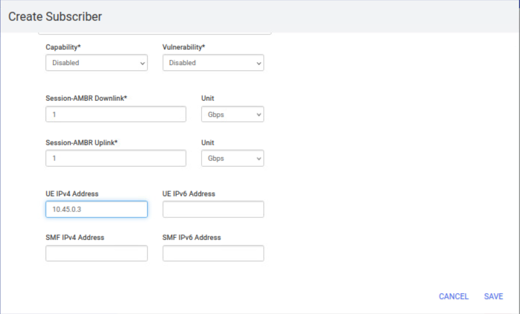
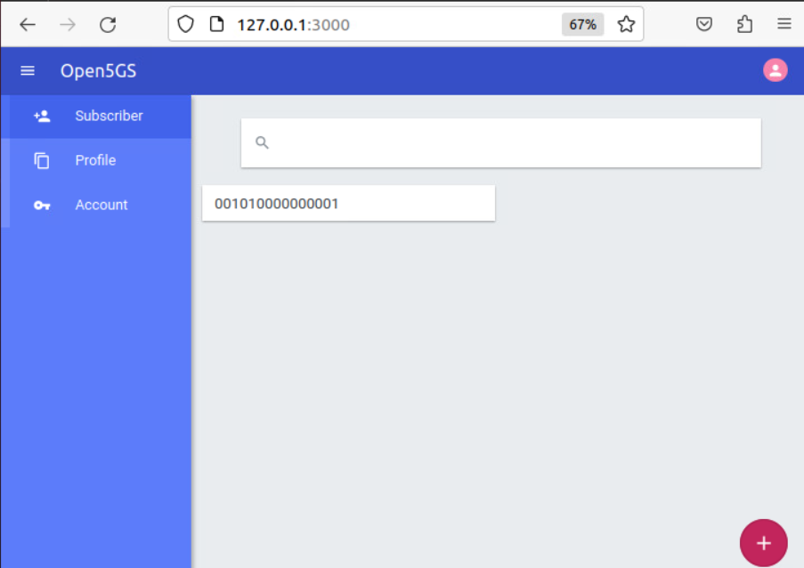

# 5G-SDN-Flood-Detection-Mitigation

## Overview
This repository contains the implementation and setup instructions for detecting and mitigating **DDoS attacks in 5G networks** using **SDN-based approaches**. Two approaches are provided:

- **Approach 1: OVS-Ryu (Baseline)** – Uses **Open vSwitch (OVS) and the RYU SDN controller** for detecting and mitigating DDoS attacks in a 5G environment.
- **Approach 2: P4-ONOS (Optimized Solution)** – Uses **P4 programmable switches and the ONOS SDN controller** to efficiently analyze and mitigate **GTP-based flooding attacks**.

This setup includes **5G Core (Open5GS)**, **RAN simulator (UERANSIM)**, **MongoDB for subscriber data**, and SDN-based **DDoS detection frameworks**.

## Setup Instructions

### Install MongoDB

#### 1. Import the Public Key and Add Repository
```bash
sudo apt update
sudo apt install wget gnupg -y
wget -qO - https://www.mongodb.org/static/pgp/server-6.0.asc | sudo apt-key add -
```

```bash
echo "deb [ arch=amd64,arm64 ] https://repo.mongodb.org/apt/ubuntu focal/mongodb-org-6.0 multiverse" | sudo tee /etc/apt/sources.list.d/mongodb-org-6.0.list
```

#### 2. Install and Start MongoDB
```bash
sudo apt update
sudo apt install -y mongodb-org
sudo systemctl start mongod
sudo systemctl enable mongod
```

#### 3. Update Configuration (Use Your Host IP Address)
```bash
sudo nano /etc/mongod.conf
```
Modify:
```diff
-  port: 27017
-  bindIp: 127.0.0.1
+  port: 27018
+  bindIp: <YOUR_HOST_IP>
```
Restart MongoDB:
```bash
sudo systemctl restart mongod.service
```

### Install ONOS-P4 Dependencies

#### 1. Install Bazel
```bash
sudo apt install apt-transport-https curl gnupg ethtool -y
curl -fsSL https://bazel.build/bazel-release.pub.gpg | gpg --dearmor > bazel-archive-keyring.gpg
sudo mv bazel-archive-keyring.gpg /usr/share/keyrings
```
```bash
echo "deb [arch=amd64 signed-by=/usr/share/keyrings/bazel-archive-keyring.gpg] https://storage.googleapis.com/bazel-apt stable jdk1.8" | sudo tee /etc/apt/sources.list.d/bazel.list
sudo apt update
sudo apt install bazel -y
```

#### 2. Install Protobuf
```bash
git clone https://github.com/adwise-fiu/5G-SDN-DDoS-Detection-Mitigation.git
sudo apt-get install g++ git bazel
cd ~/5G-SDN-DDoS-Detection-Mitigation
cp protoc-3.20.3-linux-x86_64.zip ~/
cd
unzip protoc-3.20.3-linux-x86_64.zip
sudo mv bin/protoc /usr/local/bin/
export PATH="/usr/local/bin:$PATH"
protoc --version  # Should output: libprotoc 3.20.3
```

#### 3. Install ONOS
```bash
sudo apt install openjdk-11-jdk -y
sudo apt install maven -y
sudo apt install python3 python3-dev -y
sudo ln -s /usr/bin/python3 /usr/bin/python
wget https://github.com/opennetworkinglab/onos/archive/refs/tags/2.7.0.zip --no-check-certificate
unzip 2.7.0
mv onos-2.7.0 onos
cd onos
bazel build onos
```

### Install and Configure P4 Stratum

#### 1. Install Docker
```bash
sudo apt-get install ca-certificates curl gnupg
curl -fsSL https://download.docker.com/linux/ubuntu/gpg | sudo gpg --dearmor -o /etc/apt/keyrings/docker.gpg
sudo apt-get update
sudo apt-get install docker-ce docker-ce-cli containerd.io docker-buildx-plugin docker-compose-plugin -y
sudo usermod -aG docker $USER
sudo reboot
```

#### 2. Install Stratum_BMV2
```bash
git clone https://github.com/stratum/stratum.git
cd stratum
bash setup_dev_env.sh
bazel build //stratum/hal/bin/bmv2:stratum_bmv2_deb
cp -f bazel-bin/stratum/hal/bin/bmv2/stratum_bmv2_deb.deb ./
sudo apt-get install -y --reinstall ./stratum_bmv2_deb.deb
```

### Install Open vSwitch (OVS) and RYU SDN Controller (Baseline Approach)

#### 1. Install OVS
```bash
sudo apt install openvswitch-switch -y
```

#### 2. Setup OVS Gateway
```bash
sudo ovs-vsctl add-br br-ovs-ryu
sudo ifconfig br-ovs-ryu 192.168.230.1/24
sudo sysctl -w net.ipv4.ip_forward=1
sudo iptables -t nat -A POSTROUTING -s 192.168.230.0/24 -o <YOUR_INTERFACE> -j MASQUERADE
```

#### 3. Install RYU
```bash
sudo apt install python3-pip -y
pip install ryu requests urllib3
```

### Setting Up Virtual Machines (VMs)

#### 1. Install Virt-Manager
```bash
sudo apt install virt-manager -y
```

#### 2. Download Ubuntu Image
```bash
wget https://releases.ubuntu.com/focal/ubuntu-20.04.6-desktop-amd64.iso
```

#### 3. Create Virtual Ethernet (veth) Pairs
```bash
cd ~/5G-SDN-DDoS-Detection-Mitigation
sudo bash createveth.sh
```

#### 4. Setup Virtual Machines
**Recommended VM Specs:**
- CPU: **2 cores**
- RAM: **4GB**
- Disk: **35 GiB**

Create the following VMs:
- **Control Plane (cp-1, cp-2)**
- **User Plane (up-1, up-2)**
- **gNB (gnb-1, gnb-2)**
- **UE (ue-1, ue-2)**

### Running the 5G Environment

#### Start Open5GS Core Network
```bash
~/open5gs
./install/bin/open5gs-nrfd &
./install/bin/open5gs-scpd &
./install/bin/open5gs-amfd &
./install/bin/open5gs-smfd &
./install/bin/open5gs-ausfd &
./install/bin/open5gs-udmd &
./install/bin/open5gs-pcfd &
./install/bin/open5gs-nssfd &
./install/bin/open5gs-bsfd &
./install/bin/open5gs-udrd &
```

#### Start User Plane (UPF)
```bash
~/open5gs
sudo ./install/bin/open5gs-upfd &
```

#### Start gNB (UERANSIM)
```bash
cd ~/5G-SDN-DDoS-Detection-Mitigation/UERANSIM/
./build/nr-gnb -c config/open5gs-gnb1.yaml &
```

#### Start UE (UERANSIM)
```bash
cd ~/5G-SDN-DDoS-Detection-Mitigation/UERANSIM/
./build/nr-ue -c config/open5gs-ue1.yaml &
```

## Running DDoS Detection Approaches

### Approach 1: OVS-Ryu (Baseline)
```bash
cd ~/5G-SDN-DDoS-Detection-Mitigation/approach1
```

### Approach 2: P4-ONOS (Optimized)
```bash
cd ~/5G-SDN-DDoS-Detection-Mitigation/approach2
```


#  5G-SDN-Flood-Detection-Mitigation

## Setup 


### Getting MongoDB

* Import the public key used by the package management system.

```bash
sudo apt update
sudo apt install wget gnupg -y
wget -qO - https://www.mongodb.org/static/pgp/server-6.0.asc | sudo apt-key add -
```

* Create the list file /etc/apt/sources.list.d/mongodb-org-6.0.list for your version of Ubuntu.

```bash
echo "deb [ arch=amd64,arm64 ] https://repo.mongodb.org/apt/ubuntu focal/mongodb-org/6.0 multiverse" | sudo tee /etc/apt/sources.list.d/mongodb-org-6.0.list

```

* Install the MongoDB packages.

```bash
sudo apt update 
sudo apt install -y mongodb-org
sudo systemctl start mongod
sudo systemctl enable mongod
```


* Change the config 


```shell
sudo nano /etc/mongod.conf
```

* Use your host IP address*

```diff
# mongod.conf

# for documentation of all options, see:
#   http://docs.mongodb.org/manual/reference/configuration-options/

# Where and how to store data.
storage:
  dbPath: /var/lib/mongodb
#  engine:
#  wiredTiger:

# where to write logging data.
systemLog:
  destination: file
  logAppend: true
  path: /var/log/mongodb/mongod.log

# network interfaces
net:
-  port: 27017
-  bindIp: 127.0.0.1
+  port: 27018
+  bindIp: 10.102.196.198

```


* Restart

```shell
sudo systemctl restart mongod.service
```


### ONOS-P4 Dependencies

Environment: Ubuntu 20.04 

#### Bazel

```bash
sudo apt install apt-transport-https curl gnupg ethtool -y
```

```bash
curl -fsSL https://bazel.build/bazel-release.pub.gpg | gpg --dearmor >bazel-archive-keyring.gpg
```

```bash
sudo mv bazel-archive-keyring.gpg /usr/share/keyrings
```

```bash
echo "deb [arch=amd64 signed-by=/usr/share/keyrings/bazel-archive-keyring.gpg] https://storage.googleapis.com/bazel-apt stable jdk1.8" | sudo tee /etc/apt/sources.list.d/bazel.list
```

```bash
sudo apt install maven -y 
```

```bash
sudo apt update
```

```bash
sudo apt install bazel -y
```


```bash
sudo apt install bazel-3.7.2 -y
```


#### INSTALL PROTOBUF

* Clone repo

```bash
git clone https://github.com/adwise-fiu/5G-SDN-DDoS-Detection-Mitigation.git
```

```bash
sudo apt-get install g++ git bazel
```

```bash
cd ~/5G-SDN-DDoS-Detection-Mitigation
cp protoc-3.20.3-linux-x86_64.zip ~/
cd 
unzip protoc-3.20.3-linux-x86_64.zip
sudo mv bin/protoc /usr/local/bin/
echo $PATH
export PATH="/usr/local/bin:$PATH"
```

* Verify protobuf version 

```bash
protoc --version
```

```output
libprotoc 3.20.3
```

#### Node js


```bash
sudo apt-get install -y ca-certificates curl gnupg
```


```bash
sudo mkdir -p /etc/apt/keyrings
```

```bash
curl -fsSL https://deb.nodesource.com/gpgkey/nodesource-repo.gpg.key | sudo gpg --dearmor -o /etc/apt/keyrings/nodesource.gpg
```

```bash
NODE_MAJOR=20
```

```bash
echo "deb [signed-by=/etc/apt/keyrings/nodesource.gpg] https://deb.nodesource.com/node_$NODE_MAJOR.x nodistro main" | sudo tee /etc/apt/sources.list.d/nodesource.list
```

```bash
sudo apt-get update
```

```bash
sudo apt-get install nodejs -y
```

#### ONOS 

```bash
sudo apt install openjdk-11-jdk -y
```

```bash
echo "JAVA_HOME=/usr/lib/jvm/java-11-openjdk-amd64" | sudo tee -a /etc/environment
```

```bash
sudo apt install python3
sudo apt install python3-dev -y
```

```bash
sudo ln -s /usr/bin/python3 /usr/bin/python
```

```bash
wget https://github.com/opennetworkinglab/onos/archive/refs/tags/2.7.0.zip --no-check-certificate
```

```bash
unzip 2.7.0
```

```bash
mv onos-2.7.0 onos
cd onos
```

```bash
touch .bazelrc
```

```bash
nano .bazelrc
```

```bash
build --host_force_python=PY3
```

```bash
bazel build onos
```

**TEST**

```bash
bazel run onos-local -- [clean] [debug] | grep -iv "Unable to translate flow rule for pipeconf" | tee -a onos.log
```


#### P4-STRATUM 

#### DOCKER


```bash
sudo apt-get install ca-certificates curl gnupg
```

```bash
sudo install -m 0755 -d /etc/apt/keyrings
```

```bash
curl -fsSL https://download.docker.com/linux/ubuntu/gpg | sudo gpg --dearmor -o /etc/apt/keyrings/docker.gpg
```

```bash
sudo chmod a+r /etc/apt/keyrings/docker.gpg
```

```bash
echo \
  "deb [arch="$(dpkg --print-architecture)" signed-by=/etc/apt/keyrings/docker.gpg] https://download.docker.com/linux/ubuntu \
  "$(. /etc/os-release && echo "$VERSION_CODENAME")" stable" | \
  sudo tee /etc/apt/sources.list.d/docker.list > /dev/null
```

```bash
sudo apt-get update
```

```bash
sudo apt-get install docker-ce docker-ce-cli containerd.io docker-buildx-plugin docker-compose-plugin -y
```

```bash
sudo usermod -aG docker $USER
```

```bash
sudo reboot
```

#### STRATUM_BMV2


```bash
sudo apt install git -y
```


```bash
git clone https://github.com/stratum/stratum.git
```

```bash
cd stratum
```

```bash
bash setup_dev_env.sh 
```

```bash
bazel build //stratum/hal/bin/bmv2:stratum_bmv2_deb
```

```bash
cp -f /stratum/bazel-bin/stratum/hal/bin/bmv2/stratum_bmv2_deb.deb /stratum/
```

**Exit the docker container**

`ctrl` + `d`

```bash
sudo apt update
```

```bash
sudo apt-get install -y --reinstall ./stratum_bmv2_deb.deb
cd 
```

**TO TEST**

```bash
stratum_bmv2 \
    -chassis_config_file=/etc/stratum/chassis_config.pb.txt \
    -bmv2_log_level=debug
```

#### P4

```bash
sudo apt install curl -y 
```

```bash
source /etc/lsb-release
```

```bash
echo "deb http://download.opensuse.org/repositories/home:/p4lang/xUbuntu_${DISTRIB_RELEASE}/ /" | sudo tee /etc/apt/sources.list.d/home:p4lang.list
```

```bash
curl -fsSL https://download.opensuse.org/repositories/home:p4lang/xUbuntu_${DISTRIB_RELEASE}/Release.key | gpg --dearmor | sudo tee /etc/apt/trusted.gpg.d/home_p4lang.gpg > /dev/null
```

```bash
sudo apt-get update
```

```bash
sudo apt install p4lang-p4c -y
```


#### Linux Bridge 

```bash
sudo apt update
sudo apt-get install bridge-utils -y
```

```bash
sudo brctl addbr br0
```


### OVS-RYU Dependencies


#### Install and setup Openvswitch 

* Install OVS

OVS is an SDN switch that will allow the communication between the VMs designated for the 5G environment.


```bash
sudo apt install openvswitch-switch -y
```

#### Setup OVS to behave as a gateway for the VMs

* Create the switch 

```bash
sudo ovs-vsctl add-br br-ovs-ryu 
```

* Add IP to the switch and update the NAT tables 

**RUN THIS EVERY TIME YOU REBOOT THE MACHINE**


```bash
sudo apt install net-tools -y 
sudo ifconfig br-ovs-ryu 192.168.230.1/24 
sudo sysctl -w net.ipv4.ip_forward=1
sudo iptables -t nat -A POSTROUTING -s 192.168.230.0/24 -o enp0s25 -j MASQUERADE
```


* Add the ports 

```bash
sudo ovs-vsctl add-port br-ovs-ryu cp-1 -- set Interface cp-1 type=internal
sudo ovs-vsctl add-port br-ovs-ryu up-1 -- set Interface up-1 type=internal
sudo ovs-vsctl add-port br-ovs-ryu ue-1 -- set Interface ue-1 type=internal
sudo ovs-vsctl add-port br-ovs-ryu gnb-1 -- set Interface gnb-1 type=internal
```

#### RYU

```bash
sudo apt install python3-pip -y
```

```shell
source myenv/bin/activate 
pip install ryu requests urllib3
```


```bash
sudo pip install ryu 
sudo pip uninstall eventlet -y
sudo pip install eventlet==0.20.0
```


* Verify installation

```bash
ryu-manager
```

```output
~$ ryu-manager
loading app ryu.controller.ofp_handler
instantiating app ryu.controller.ofp_handler of OFPHandler
```


## Setup VMs 

### Install Virt-manager 

```bash
sudo apt install virt-manager -y 
```

### Install Linux bridge 

```bash
sudo apt install bridge-utils -y 
```

### Download the Ubuntu VM 

```bash
wget https://releases.ubuntu.com/focal/ubuntu-20.04.6-desktop-amd64.iso
```


### Create the Veth pairs 

```bash
cd 5G-SDN-DDoS-Detection-Mitigation
sudo bash createveth.sh
```


```bash
sudo brctl addif br0 veth11
```

```bash
sudo ip addr add 192.168.235.1/24 dev br0
sudo ip link set dev br0 up
```


```bash 
sudo sysctl -w net.ipv4.ip_forward=1
sudo iptables -t nat -A POSTROUTING -s 192.168.235.0/24 ! -o enp1s0 -j MASQUERADE
```


### Create a VM 

```bash
sudo virt-manager 
```

#### VM details 
**CPU:** 2
**RAM:** 4GB
**Disk:** 35 GiB

#### Create VM using GUI

* Click on `create a new virtual machine` button*

Follow the following selections

<p align="center">
  
</p>

<p align="center">
  
</p>

<p align="center">
  
</p>

<p align="center">
  
</p>

<p align="center">
  
</p>

<p align="center">
  
</p>


Do the same for the other vms:
* cp-1 
* up-1
* gnb-1
* ue-1
* cp-2
* up-2
* gnb-2
* ue-2

Complete the ubuntu setup for all the machines using the GUI

#### Create VM using CLI

##### Approach 1 


* cp-1

```shell
USERNAME=$(whoami)
sudo virt-install \
  --name cp-1 \
  --ram 4096 \
  --vcpus 2 \
  --cpu IvyBridge-IBRS \
  --disk path=/var/lib/libvirt/images/cp-1.qcow2,format=qcow2,size=30 \
  --os-type linux \
  --os-variant ubuntu20.04 \
  --network bridge=virbr0,model=virtio \
--network type=direct,source=cp-1,source_mode=bridge,model=virtio \
--network type=direct,source=cp-1,source_mode=bridge,model=virtio \
  --graphics spice \
  --console pty,target_type=serial \
  --cdrom /home/$USERNAME/ubuntu-20.04.6-desktop-amd64.iso &
```


* up-1

```shell
USERNAME=$(whoami)
sudo virt-install \
  --name up-1 \
  --ram 4096 \
  --vcpus 2 \
  --cpu IvyBridge-IBRS \
  --disk path=/var/lib/libvirt/images/up-1.qcow2,format=qcow2,size=30 \
  --os-type linux \
  --os-variant ubuntu20.04 \
  --network bridge=virbr0,model=virtio \
--network type=direct,source=up-1,source_mode=bridge,model=virtio \
  --graphics spice \
  --console pty,target_type=serial \
  --cdrom /home/$USERNAME/ubuntu-20.04.6-desktop-amd64.iso &
```


* gnb-1

```shell
USERNAME=$(whoami)
sudo virt-install \
  --name gnb-1 \
  --ram 4096 \
  --vcpus 2 \
  --cpu IvyBridge-IBRS \
  --disk path=/var/lib/libvirt/images/gnb-1.qcow2,format=qcow2,size=30 \
  --os-type linux \
  --os-variant ubuntu20.04 \
  --network bridge=virbr0,model=virtio \
--network type=direct,source=gnb-1,source_mode=bridge,model=virtio \
  --graphics spice \
  --console pty,target_type=serial \
  --cdrom /home/$USERNAME/ubuntu-20.04.6-desktop-amd64.iso  & 
```

* ue-1

```shell
USERNAME=$(whoami)
sudo virt-install \
  --name ue-1 \
  --ram 4096 \
  --vcpus 2 \
  --cpu IvyBridge-IBRS \
  --disk path=/var/lib/libvirt/images/ue-1.qcow2,format=qcow2,size=30 \
  --os-type linux \
  --os-variant ubuntu20.04 \
  --network bridge=virbr0,model=virtio \
--network type=direct,source=ue-1,source_mode=bridge,model=virtio \
  --graphics spice \
  --console pty,target_type=serial \
  --cdrom /home/$USERNAME/ubuntu-20.04.6-desktop-amd64.iso  & 
```


##### Approach 2
* cp-2

```shell
USERNAME=$(whoami)
sudo virt-install \
  --name cp-2 \
  --ram 4096 \
  --vcpus 2 \
  --cpu IvyBridge-IBRS \
  --disk path=/var/lib/libvirt/images/cp-2.qcow2,format=qcow2,size=30 \
  --os-type linux \
  --os-variant ubuntu20.04 \
  --network bridge=virbr0,model=virtio \
--network type=direct,source=veth1,source_mode=bridge,model=virtio \
--network type=direct,source=veth3,source_mode=bridge,model=virtio \
  --graphics spice \
  --console pty,target_type=serial \
  --cdrom /home/$USERNAME/ubuntu-20.04.6-desktop-amd64.iso &
```


* up-2

```shell
USERNAME=$(whoami)
sudo virt-install \
  --name up-2 \
  --ram 4096 \
  --vcpus 2 \
  --cpu IvyBridge-IBRS \
  --disk path=/var/lib/libvirt/images/up-2.qcow2,format=qcow2,size=30 \
  --os-type linux \
  --os-variant ubuntu20.04 \
  --network bridge=virbr0,model=virtio \
--network type=direct,source=veth5,source_mode=bridge,model=virtio \
  --graphics spice \
  --console pty,target_type=serial \
  --cdrom /home/$USERNAME/ubuntu-20.04.6-desktop-amd64.iso &
```


* gnb-2

```shell
USERNAME=$(whoami)
sudo virt-install \
  --name gnb-2 \
  --ram 4096 \
  --vcpus 2 \
  --cpu IvyBridge-IBRS \
  --disk path=/var/lib/libvirt/images/gnb-2.qcow2,format=qcow2,size=30 \
  --os-type linux \
  --os-variant ubuntu20.04 \
  --network bridge=virbr0,model=virtio \
--network type=direct,source=veth7,source_mode=bridge,model=virtio \
  --graphics spice \
  --console pty,target_type=serial \
  --cdrom /home/$USERNAME/ubuntu-20.04.6-desktop-amd64.iso  & 
```

* ue-2

```shell
USERNAME=$(whoami)
sudo virt-install \
  --name ue-2 \
  --ram 4096 \
  --vcpus 2 \
  --cpu IvyBridge-IBRS \
  --disk path=/var/lib/libvirt/images/ue-2.qcow2,format=qcow2,size=30 \
  --os-type linux \
  --os-variant ubuntu20.04 \
  --network bridge=virbr0,model=virtio \
--network type=direct,source=veth9,source_mode=bridge,model=virtio \
  --graphics spice \
  --console pty,target_type=serial \
  --cdrom /home/$USERNAME/ubuntu-20.04.6-desktop-amd64.iso  & 
```

#### Install dependencies 

* Run the following commands

```shell
sudo apt update; sudo apt install openssh-server -y ; sudo apt upgrade -y ; sudo apt install net-tools -y 
```

#### Create snapshots

```shell
sudo virsh snapshot-create cp-1 ; sudo virsh snapshot-create cp-2 ; sudo virsh snapshot-create up-1 ; sudo virsh snapshot-create up-2; sudo virsh snapshot-create gnb-1 ; sudo virsh snapshot-create gnb-2; sudo virsh snapshot-create ue-1 ; sudo virsh snapshot-create ue-2 ;
```

### Generate ssh scripts

```shell
cd ~/5G-SDN-DDoS-Detection-Mitigation/ssh_scripts
sudo chmod +x generate_ssh.sh

```


## 5G environment 

### Open5GS - CP 

* Use the ssh and multiexec terminal to run the following commands for cp-1 and cp-2


##### CP-1 Add IP addresses

* IP for AMF*


```shell
sudo nmcli con add type ethernet ifname enp2s0 con-name enp2s0 ipv4.method manual ipv4.addresses 192.168.230.2/24 ipv4.gateway 192.168.230.1 ipv4.dns "8.8.8.8,8.8.4.4"
sudo nmcli con up enp2s0
```


* IP for SMF*

```shell
sudo nmcli con add type ethernet ifname enp3s0 con-name enp3s0 ipv4.method manual ipv4.addresses 192.168.230.3/24 ipv4.gateway 192.168.230.1 ipv4.dns "8.8.8.8,8.8.4.4"
sudo nmcli con up enp3s0
```


##### CP-2 Add IP addresses

* IP for AMF*

```shell
sudo nmcli con add type ethernet ifname enp2s0 con-name enp2s0 ipv4.method manual ipv4.addresses 192.168.235.2/24 ipv4.gateway 192.168.235.1 ipv4.dns "8.8.8.8,8.8.4.4"
sudo nmcli con up enp2s0
```

* IP for SMF*

```shell
sudo nmcli con add type ethernet ifname enp3s0 con-name enp3s0 ipv4.method manual ipv4.addresses 192.168.235.3/24 ipv4.gateway 192.168.235.1 ipv4.dns "8.8.8.8,8.8.4.4"
sudo nmcli con up enp3s0
```


#### Getting MongoDB

* Import the public key used by the package management system.

```bash
sudo apt update
sudo apt install wget gnupg -y
wget -qO - https://www.mongodb.org/static/pgp/server-6.0.asc | sudo apt-key add -
```

* Create the list file /etc/apt/sources.list.d/mongodb-org-6.0.list for your version of Ubuntu.

```bash
echo "deb [ arch=amd64,arm64 ] https://repo.mongodb.org/apt/ubuntu focal/mongodb-org/6.0 multiverse" | sudo tee /etc/apt/sources.list.d/mongodb-org-6.0.list

```

* Install the MongoDB packages.

```bash
sudo apt update 
sudo apt install -y mongodb-org
sudo systemctl start mongod
sudo systemctl enable mongod
```

#### Getting Open5GS as a source 


* Install the dependencies for building the source code.

```bash
sudo apt install python3-pip python3-setuptools python3-wheel ninja-build build-essential flex bison git cmake libsctp-dev libgnutls28-dev libgcrypt-dev libssl-dev libidn11-dev libmongoc-dev libbson-dev libyaml-dev wget libnghttp2-dev libmicrohttpd-dev libcurl4-gnutls-dev libnghttp2-dev libtins-dev libtalloc-dev meson -y
```

* Git clone 

```bash
wget https://github.com/open5gs/open5gs/archive/refs/tags/v2.6.6.zip --no-check-certificate
```

* Unzip the repo 


```bash
unzip v2.6.6.zip
mv open5gs-2.6.6/ open5gs
cd open5gs 
```


* To compile with meson:

```bash
meson build --prefix=`pwd`/install
ninja -C build
```

* perform the installation process.

```bash
cd build
ninja install
cd ../
```


##### CP-1 AMF config

* Modify the config files for AMF and SMF. This is only for the control Plane

```bash
sudo nano install/etc/open5gs/amf.yaml
```

```diff
amf:
    sbi:
      - addr: 127.0.0.5
        port: 7777
    ngap:
-      - addr: 127.0.0.5
+      - addr: 192.168.230.2
    metrics:
      - addr: 127.0.0.5
        port: 9090
    guami:
      - plmn_id:
-          mcc: 999
-          mnc: 70
+          mcc: 001
+          mnc: 01
        amf_id:
          region: 2
          set: 1
    tai:
      - plmn_id:
-          mcc: 999
-          mnc: 70
+          mcc: 001
+          mnc: 01
+        tac: 1
    plmn_support:
      - plmn_id:
-          mcc: 999
-          mnc: 70
+          mcc: 001
+          mnc: 01
        s_nssai:
          - sst: 1
    security:
        integrity_order : [ NIA2, NIA1, NIA0 ]
        ciphering_order : [ NEA0, NEA1, NEA2 ]
    network_name:
        full: Open5GS
    amf_name: open5gs-amf0
```


```bash
sudo nano install/etc/open5gs/smf.yaml
```


```diff
smf:
    sbi:
      - addr: 127.0.0.4
        port: 7777
    pfcp:
-      - addr: 127.0.0.4
-      - addr: ::1
+      - addr: 192.168.230.3
+      #- addr: ::1
    gtpc:
      - addr: 127.0.0.4
-      - addr: ::1
+      #- addr: ::1
    gtpu:
      - addr: 127.0.0.4
-      - addr: ::1
+      #- addr: ::1
    metrics:
      - addr: 127.0.0.4
        port: 9090
    subnet:
      - addr: 10.45.0.1/16
      - addr: 2001:db8:cafe::1/48
    dns:
      - 8.8.8.8
      - 8.8.4.4
      - 2001:4860:4860::8888
      - 2001:4860:4860::8844
    mtu: 1400
    ctf:
      enabled: auto
    freeDiameter: /home/cp/open5gs/install/etc/freeDiameter/smf.conf


upf:
    pfcp:
-      - addr: 127.0.0.7
+      - addr: 192.168.230.4

```


##### CP-2 AMF config

* Modify the config files for AMF and SMF. This is only for the control Plane

```bash
sudo nano install/etc/open5gs/amf.yaml
```

```diff
amf:
    sbi:
      - addr: 127.0.0.5
        port: 7777
    ngap:
-      - addr: 127.0.0.5
+      - addr: 192.168.235.2
    metrics:
      - addr: 127.0.0.5
        port: 9090
    guami:
      - plmn_id:
-          mcc: 999
-          mnc: 70
+          mcc: 001
+          mnc: 01
        amf_id:
          region: 2
          set: 1
    tai:
      - plmn_id:
-          mcc: 999
-          mnc: 70
+          mcc: 001
+          mnc: 01
+        tac: 1
    plmn_support:
      - plmn_id:
-          mcc: 999
-          mnc: 70
+          mcc: 001
+          mnc: 01
        s_nssai:
          - sst: 1
    security:
        integrity_order : [ NIA2, NIA1, NIA0 ]
        ciphering_order : [ NEA0, NEA1, NEA2 ]
    network_name:
        full: Open5GS
    amf_name: open5gs-amf0
```


```bash
sudo nano install/etc/open5gs/smf.yaml
```


```diff
smf:
    sbi:
      - addr: 127.0.0.4
        port: 7777
    pfcp:
-      - addr: 127.0.0.4
-      - addr: ::1
+      - addr: 192.168.235.3
+      #- addr: ::1
    gtpc:
      - addr: 127.0.0.4
-      - addr: ::1
+      #- addr: ::1
    gtpu:
      - addr: 127.0.0.4
-      - addr: ::1
+      #- addr: ::1
    metrics:
      - addr: 127.0.0.4
        port: 9090
    subnet:
      - addr: 10.45.0.1/16
      - addr: 2001:db8:cafe::1/48
    dns:
      - 8.8.8.8
      - 8.8.4.4
      - 2001:4860:4860::8888
      - 2001:4860:4860::8844
    mtu: 1400
    ctf:
      enabled: auto
    freeDiameter: /home/cp/open5gs/install/etc/freeDiameter/smf.conf


upf:
    pfcp:
-      - addr: 127.0.0.7
+      - addr: 192.168.235.4

```


#### Building the WebUI of Open5GS

The WebUI allows you to interactively edit subscriber data. While it is not essential to use this, it makes things easier when you are just starting out on your Open5GS adventure. (A command line tool is available for advanced users).


Node.js is required to build WebUI of Open5GS

```bash
sudo apt update
sudo apt install -y ca-certificates curl gnupg
sudo mkdir -p /etc/apt/keyrings
curl -fsSL https://deb.nodesource.com/gpgkey/nodesource-repo.gpg.key | sudo gpg --dearmor -o /etc/apt/keyrings/nodesource.gpg

NODE_MAJOR=20
echo "deb [signed-by=/etc/apt/keyrings/nodesource.gpg] https://deb.nodesource.com/node_$NODE_MAJOR.x nodistro main" | sudo tee /etc/apt/sources.list.d/nodesource.list


sudo apt update
sudo apt install nodejs -y

```

* Install the dependencies to run WebUI

```bash
cd webui
npm ci
```

* The WebUI runs as an npm script.

```bash
npm run dev &
```

#### Register Subscriber Information

Connect to http://127.0.0.1:3000 and login with admin account.

Username : admin
Password : 1423

You can change the password after login 

<p align="center">
  
</p>


<p align="center">
  
</p>


<p align="center">
  
</p>

<p align="center">
  
</p>


<p align="center">
  
</p>


#### Add subscriber using CLI 

```bash
mongosh 
show dbs
use open5gs
```

Make sure to specify the wanted parameters. 
We wanted 
IMSI 001010000000001
UE IP: 10.45.0.3


```bash
db.subscribers.insertOne({
  imsi: '001010000000001',
  msisdn: [],
  imeisv: '4301816125816151',
  mme_host: [],
  mme_realm: [],
  purge_flag: [],
  security: {
    k: '465B5CE8 B199B49F AA5F0A2E E238A6BC',
    op: null,
    opc: 'E8ED289D EBA952E4 283B54E8 8E6183CA',
    amf: '8000',
    sqn: NumberLong("513")
  },
  ambr: { downlink: { value: 1, unit: 3 }, uplink: { value: 1, unit: 3 } },
  slice: [
    {
      sst: 1,
      default_indicator: true,
      session: [
        {
          name: 'internet',
          type: 3,
          qos: { index: 9, arp: { priority_level: 8, pre_emption_capability: 1, pre_emption_vulnerability: 1 } },
          ambr: { downlink: { value: 1, unit: 3 }, uplink: { value: 1, unit: 3 } },
          ue: { addr: '10.45.0.3' },
          _id: ObjectId("6473fd45a07e473e0b5334ce"),
          pcc_rule: []
        }
      ],
      _id: ObjectId("6473fd45a07e473e0b5334cd")
    }
  ],
  access_restriction_data: 32,
  subscriber_status: 0,
  network_access_mode: 0,
  subscribed_rau_tau_timer: 12,
  __v: 0
})
```

```bash
db.subscribers.insertOne({
  imsi: '001010000000002',
  msisdn: [],
  imeisv: '4301816125816151',
  mme_host: [],
  mme_realm: [],
  purge_flag: [],
  security: {
    k: '465B5CE8 B199B49F AA5F0A2E E238A6BC',
    op: null,
    opc: 'E8ED289D EBA952E4 283B54E8 8E6183CA',
    amf: '8000',
    sqn: NumberLong("513")
  },
  ambr: { downlink: { value: 1, unit: 3 }, uplink: { value: 1, unit: 3 } },
  slice: [
    {
      sst: 1,
      default_indicator: true,
      session: [
        {
          name: 'internet',
          type: 3,
          qos: { index: 9, arp: { priority_level: 8, pre_emption_capability: 1, pre_emption_vulnerability: 1 } },
          ambr: { downlink: { value: 1, unit: 3 }, uplink: { value: 1, unit: 3 } },
          ue: { addr: '10.45.0.4' },
          _id: ObjectId("6473fd45a07e473e0b5334ce"),
          pcc_rule: []
        }
      ],
      _id: ObjectId("6473fd45a07e473e0b5334cd")
    }
  ],
  access_restriction_data: 32,
  subscriber_status: 0,
  network_access_mode: 0,
  subscribed_rau_tau_timer: 12,
  __v: 0
})

```


`ctrl`+`d`


#### Running Open5GS - CP


```bash
~/open5gs
```


```bash
./install/bin/open5gs-nrfd &
./install/bin/open5gs-scpd &
./install/bin/open5gs-amfd &
./install/bin/open5gs-smfd &
./install/bin/open5gs-ausfd &
./install/bin/open5gs-udmd &
./install/bin/open5gs-pcfd &
./install/bin/open5gs-nssfd &
./install/bin/open5gs-bsfd &
./install/bin/open5gs-udrd &
```


### Open5GS - UP 


* Use the ssh and multiexec terminal to run the following commands for up-1 and up-2

```shell
cd ~/5G-SDN-DDoS-Detection-Mitigation/ssh_scripts
sudo bash up-1.sh
sudo bash up-2.sh
```

##### UP-1 Add IP addresses

* IP for UPF*

```shell
sudo nmcli con add type ethernet ifname enp2s0 con-name enp2s0 ipv4.method manual ipv4.addresses 192.168.230.4/24 ipv4.gateway 192.168.230.1 ipv4.dns "8.8.8.8,8.8.4.4"
sudo nmcli con up enp2s0
```

##### UP-2 Add IP addresses

* IP for UPF*

```shell
sudo nmcli con add type ethernet ifname enp2s0 con-name enp2s0 ipv4.method manual ipv4.addresses 192.168.235.4/24 ipv4.gateway 192.168.235.1 ipv4.dns "8.8.8.8,8.8.4.4"
sudo nmcli con up enp2s0
```


#### Getting Open5GS as a source 


* Install the dependencies for building the source code.

```bash
sudo apt install python3-pip python3-setuptools python3-wheel ninja-build build-essential flex bison git cmake libsctp-dev libgnutls28-dev libgcrypt-dev libssl-dev libidn11-dev libmongoc-dev libbson-dev libyaml-dev wget libnghttp2-dev libmicrohttpd-dev libcurl4-gnutls-dev libnghttp2-dev libtins-dev libtalloc-dev meson -y
```

* Git clone 

```bash
wget https://github.com/open5gs/open5gs/archive/refs/tags/v2.6.6.zip --no-check-certificate
```

* Unzip the repo 


```bash
unzip v2.6.6.zip
mv open5gs-2.6.6/ open5gs
cd open5gs 
```

* To compile with meson:

```bash
meson build --prefix=`pwd`/install
ninja -C build
```

* perform the installation process.

```bash
cd build
ninja install
cd ../
```

##### UP-1 UPF Config 

* Modify the config files for UPF. This is only for the User Plane

```bash
nano install/etc/open5gs/upf.yaml
```

```diff
upf:
    pfcp:
-      - addr: 127.0.0.7
+      - addr: 192.168.230.4
    gtpu:
-      - addr: 127.0.0.7
+      - addr: 192.168.230.4
    subnet:
      - addr: 10.45.0.1/16
      - addr: 2001:db8:cafe::1/48
    metrics:
      - addr: 127.0.0.7
        port: 9090
```


##### UP-2 UPF Config 

* Modify the config files for UPF. This is only for the User Plane

```bash
nano install/etc/open5gs/upf.yaml
```

```diff
upf:
    pfcp:
-      - addr: 127.0.0.7
+      - addr: 192.168.235.4
    gtpu:
-      - addr: 127.0.0.7
+      - addr: 192.168.235.4
    subnet:
      - addr: 10.45.0.1/16
      - addr: 2001:db8:cafe::1/48
    metrics:
      - addr: 127.0.0.7
        port: 9090
```


#### Running Open5GS - UP


```shell
sudo ip tuntap add name ogstun mode tun
sudo ip addr add 10.45.0.1/16 dev ogstun
sudo ip addr add 2001:db8:cafe::1/48 dev ogstun
sudo ip link set ogstun up
```


* Allow UE network traffic to access the internet. 

```bash
sudo sysctl -w net.ipv4.ip_forward=1
sudo iptables -t nat -A POSTROUTING -s 10.45.0.0/16 ! -o ogstun -j MASQUERADE
```


```bash
~/open5gs
sudo ./install/bin/open5gs-upfd &
```


### UERANSIM - gNB


* Use the ssh and multiexec terminal to run the following commands for gnb-1 and gnb-2

```shell
cd ~/5G-SDN-DDoS-Detection-Mitigation/ssh_scripts
sudo bash gnb-1.sh
sudo bash gnb-2.sh
```

##### gNB-1 Add IP addresses

* IP for gNB*

```shell
sudo nmcli con add type ethernet ifname enp2s0 con-name enp2s0 ipv4.method manual ipv4.addresses 192.168.230.5/24 ipv4.gateway 192.168.230.1 ipv4.dns "8.8.8.8,8.8.4.4"
sudo nmcli con up enp2s0
```

##### gNB-2 Add IP addresses

* IP for gNB*

```shell
sudo nmcli con add type ethernet ifname enp2s0 con-name enp2s0 ipv4.method manual ipv4.addresses 192.168.235.5/24 ipv4.gateway 192.168.235.1 ipv4.dns "8.8.8.8,8.8.4.4"
sudo nmcli con up enp2s0
```


#### Getting the UERANSIM

```bash
sudo apt update && sudo apt upgrade -y 
sudo apt install openssh-server -y 
sudo apt install git -y
```

* Clone repo 

```bash 
cd ~/5G-SDN-DDoS-Detection-Mitigation
cd UERANSIM
```

* Install the required dependencies 

```bash 
sudo apt install make gcc g++ libsctp-dev lksctp-tools iproute2 build-essential -y
sudo snap install cmake --classic
```
#### Build UERANSIM

```bash 
cd ~/5G-SDN-DDoS-Detection-Mitigation/UERANSIM
make
```

#### gNB1 Configuration

```bash 
cd config
cp open5gs-gnb.yaml open5gs-gnb1.yaml
nano open5gs-gnb1.yaml
```

```diff
-mcc: '999'          # Mobile Country Code value
+mcc: '001'          # Mobile Country Code value

-mnc: '70'           # Mobile Network Code value (2 or 3 digits)
+mnc: '01'           # Mobile Network Code value (2 or 3 digits)

nci: '0x000000010'  # NR Cell Identity (36-bit)
idLength: 32        # NR gNB ID length in bits [22...32]
+tac: 1              # Tracking Area Code

-linkIp: 127.0.0.1   # gNB's local IP address for Radio Link Simulation (Usually same with local IP)
-ngapIp: 127.0.0.1   # gNB's local IP address for N2 Interface (Usually same with local IP)
-gtpIp: 127.0.0.1    # gNB's local IP address for N3 Interface (Usually same with local IP)

+linkIp: 192.168.230.5   # gNB's local IP address for Radio Link Simulation (Usually same with local IP)
+ngapIp: 192.168.230.5   # gNB's local IP address for N2 Interface (Usually same with local IP)
+gtpIp: 192.168.230.5    # gNB's local IP address for N3 Interface (Usually same with local IP)


# List of AMF address information
amfConfigs:
-  - address: 127.0.0.5
+  - address: 192.168.230.2
    port: 38412

# List of supported S-NSSAIs by this gNB
slices:
  - sst: 1

# Indicates whether or not SCTP stream number errors should be ignored.
ignoreStreamIds: true```


## Start using the gNB - UERANSIM 

After completing configurations and setups, now you can start using UERANSIM.
```

Run the following command to start the gNB:

```bash 
cd ..
./build/nr-gnb -c config/open5gs-gnb1.yaml
```


#### gNB2 Configuration

```bash 
cd config
sudo cp open5gs-gnb.yaml open5gs-gnb1.yaml
sudo nano open5gs-gnb1.yaml
```

```diff
-mcc: '999'          # Mobile Country Code value
+mcc: '001'          # Mobile Country Code value

-mnc: '70'           # Mobile Network Code value (2 or 3 digits)
+mnc: '01'           # Mobile Network Code value (2 or 3 digits)

nci: '0x000000010'  # NR Cell Identity (36-bit)
idLength: 32        # NR gNB ID length in bits [22...32]
+tac: 1              # Tracking Area Code

-linkIp: 127.0.0.1   # gNB's local IP address for Radio Link Simulation (Usually same with local IP)
-ngapIp: 127.0.0.1   # gNB's local IP address for N2 Interface (Usually same with local IP)
-gtpIp: 127.0.0.1    # gNB's local IP address for N3 Interface (Usually same with local IP)

+linkIp: 192.168.235.5   # gNB's local IP address for Radio Link Simulation (Usually same with local IP)
+ngapIp: 192.168.235.5   # gNB's local IP address for N2 Interface (Usually same with local IP)
+gtpIp: 192.168.235.5    # gNB's local IP address for N3 Interface (Usually same with local IP)


# List of AMF address information
amfConfigs:
-  - address: 127.0.0.5
+  - address: 192.168.235.2
    port: 38412

# List of supported S-NSSAIs by this gNB
slices:
  - sst: 1

# Indicates whether or not SCTP stream number errors should be ignored.
ignoreStreamIds: true```


## Start using the gNB - UERANSIM 

After completing configurations and setups, now you can start using UERANSIM.
```

Run the following command to start the gNB:

```bash 
cd ..
./build/nr-gnb -c config/open5gs-gnb1.yaml
```


#### Start using the gNB - UERANSIM 

After completing configurations and setups, now you can start using UERANSIM.

Run the following command to start the gNB:

```bash 
cd ~/5G-SDN-DDoS-Detection-Mitigation/UERANSIM/
sudo pkill -f nr-gnb
sudo ./build/nr-gnb -c config/open5gs-gnb1.yaml &
```


### UERANSIM - UE


* Use the ssh and multiexec terminal to run the following commands for ue-1 and ue-2

```shell
cd ~/5G-SDN-DDoS-Detection-Mitigation/ssh_scripts
sudo bash ue-1.sh
sudo bash ue-2.sh
```

##### UE-1 Add IP addresses

* IP for UE*

```shell
sudo nmcli con add type ethernet ifname enp2s0 con-name enp2s0 ipv4.method manual ipv4.addresses 192.168.230.6/24 ipv4.gateway 192.168.230.1 ipv4.dns "8.8.8.8,8.8.4.4"
sudo nmcli con up enp2s0
```

##### UE-2 Add IP addresses

* IP for UE*

```shell
sudo nmcli con add type ethernet ifname enp2s0 con-name enp2s0 ipv4.method manual ipv4.addresses 192.168.235.6/24 ipv4.gateway 192.168.235.1 ipv4.dns "8.8.8.8,8.8.4.4"
sudo nmcli con up enp2s0
```


#### Getting the UERANSIM

```bash
sudo apt update ; sudo apt upgrade -y 
sudo apt install openssh-server -y 
sudo apt install git -y
```


* Clone repo 

```bash 
cd ~
wget https://github.com/aligungr/UERANSIM/archive/refs/heads/master.zip  --no-check-certificate
unzip master.zip
mv UERANSIM-master/ UERANSIM
cd UERANSIM
```

* Install the required dependencies 

```bash 
sudo apt install make gcc g++ libsctp-dev lksctp-tools iproute2 build-essential -y
sudo snap install cmake --classic
```

#### Build UERANSIM

```bash 
cd ~/UERANSIM
make
```

#### UE1 Configuration

```bash 
cd config
cp open5gs-ue.yaml open5gs-ue1.yaml
nano open5gs-ue1.yaml
```

```diff
# IMSI number of the UE. IMSI = [MCC|MNC|MSISDN] (In total 15 digits)
-supi: 'imsi-999700000000001'
+supi: 'imsi-001010000000001'
# Mobile Country Code value of HPLMN
-mcc: '999'
+mcc: '001'
# Mobile Network Code value of HPLMN (2 or 3 digits)
-mnc: '70'
+mnc: '01'

# Permanent subscription key
key: '465B5CE8B199B49FAA5F0A2EE238A6BC'
# Operator code (OP or OPC) of the UE
op: 'E8ED289DEBA952E4283B54E88E6183CA'
# This value specifies the OP type and it can be either 'OP' or 'OPC'
opType: 'OPC'
# Authentication Management Field (AMF) value
amf: '8000'
# IMEI number of the device. It is used if no SUPI is provided
imei: '356938035643803'
# IMEISV number of the device. It is used if no SUPI and IMEI is provided
imeiSv: '4370816125816151'

# List of gNB IP addresses for Radio Link Simulation
gnbSearchList:
-  - 127.0.0.1
+  - 192.168.230.5

# UAC Access Identities Configuration
uacAic:
  mps: false
  mcs: false

# UAC Access Control Class
uacAcc:
  normalClass: 0
  class11: false
  class12: false
  class13: false
  class14: false
  class15: false

# Initial PDU sessions to be established
sessions:
  - type: 'IPv4'
    apn: 'internet'
    slice:
      sst: 1

# Configured NSSAI for this UE by HPLMN
configured-nssai:
  - sst: 1

# Default Configured NSSAI for this UE
default-nssai:
  - sst: 1
    sd: 1

# Supported integrity algorithms by this UE
integrity:
  IA1: true
  IA2: true
  IA3: true

# Supported encryption algorithms by this UE
ciphering:
  EA1: true
  EA2: true
  EA3: true

# Integrity protection maximum data rate for user plane
integrityMaxRate:
  uplink: 'full'
  downlink: 'full'

```


#### UE2 Configuration

```bash 
cd config
sudo cp open5gs-ue.yaml open5gs-ue1.yaml
sudo nano open5gs-ue1.yaml
```

```diff
# IMSI number of the UE. IMSI = [MCC|MNC|MSISDN] (In total 15 digits)
-supi: 'imsi-999700000000001'
+supi: 'imsi-001010000000001'
# Mobile Country Code value of HPLMN
-mcc: '999'
+mcc: '001'
# Mobile Network Code value of HPLMN (2 or 3 digits)
-mnc: '70'
+mnc: '01'

# Permanent subscription key
key: '465B5CE8B199B49FAA5F0A2EE238A6BC'
# Operator code (OP or OPC) of the UE
op: 'E8ED289DEBA952E4283B54E88E6183CA'
# This value specifies the OP type and it can be either 'OP' or 'OPC'
opType: 'OPC'
# Authentication Management Field (AMF) value
amf: '8000'
# IMEI number of the device. It is used if no SUPI is provided
imei: '356938035643803'
# IMEISV number of the device. It is used if no SUPI and IMEI is provided
imeiSv: '4370816125816151'

# List of gNB IP addresses for Radio Link Simulation
gnbSearchList:
-  - 127.0.0.1
+  - 192.168.235.5

# UAC Access Identities Configuration
uacAic:
  mps: false
  mcs: false

# UAC Access Control Class
uacAcc:
  normalClass: 0
  class11: false
  class12: false
  class13: false
  class14: false
  class15: false

# Initial PDU sessions to be established
sessions:
  - type: 'IPv4'
    apn: 'internet'
    slice:
      sst: 1

# Configured NSSAI for this UE by HPLMN
configured-nssai:
  - sst: 1

# Default Configured NSSAI for this UE
default-nssai:
  - sst: 1
    sd: 1

# Supported integrity algorithms by this UE
integrity:
  IA1: true
  IA2: true
  IA3: true

# Supported encryption algorithms by this UE
ciphering:
  EA1: true
  EA2: true
  EA3: true

# Integrity protection maximum data rate for user plane
integrityMaxRate:
  uplink: 'full'
  downlink: 'full'

```


#### Start using the UE - UERANSIM 

After completing configurations and setups, now you can start using UERANSIM.

Run the following command to start the UE:

```bash 
cd ~/5G-SDN-DDoS-Detection-Mitigation/UERANSIM/
sudo pkill -f nr-ue
sudo ./build/nr-ue -c config/open5gs-ue1.yaml &
```


**Test if the environment is working **

```shell
ping -I uesimtun0 -c 2 8.8.8.8
```

**Output:**

```
ping -I uesimtun0 -c 2 8.8.8.8
PING 8.8.8.8 (8.8.8.8) from 10.45.0.3 uesimtun0: 56(84) bytes of data.
64 bytes from 8.8.8.8: icmp_seq=1 ttl=116 time=5.50 ms
64 bytes from 8.8.8.8: icmp_seq=2 ttl=116 time=5.10 ms

--- 8.8.8.8 ping statistics ---
2 packets transmitted, 2 received, 0% packet loss, time 1002ms
rtt min/avg/max/mdev = 5.104/5.302/5.500/0.198 ms
```


## GTP-OVS-RYU


* Make sure that the vms are up and running*

```shell
sudo virsh start cp-1
sudo virsh start up-1
sudo virsh start gnb-1
sudo virsh start ue-1
```

* Start the 5G environment*

**CP**  
[Running Open5GS - CP](#running-open5gs---cp)

**UP**  
[Running Open5GS - UP](#running-open5gs---up)

**gNB**  
[Start using the gNB - UERANSIM](#start-using-the-gnb---ueransim)

**UE**  
[Start using the UE - UERANSIM](#start-using-the-ue---ueransim)


#### Approach 1: OVS-Ryu Based DDoS Detection and Mitigation (Baseline)
This directory contains the implementation of Approach 1, which uses Open vSwitch (OVS) and the Ryu SDN controller as the baseline method for DDoS detection and mitigation in 5G networks.

```shell
cd ~/5G-SDN-DDoS-Detection-Mitigation/approach1
```
[approach1](./approach1)

#### Approach 2: P4-ONOS Based Real-Time DDoS Detection and Mitigation
This directory contains the implementation of Approach 2, which leverages P4 and the ONOS SDN controller for real-time DDoS detection and mitigation.

```shell
cd ~/5G-SDN-DDoS-Detection-Mitigation/approach2
```
[approach2](./approach2)


